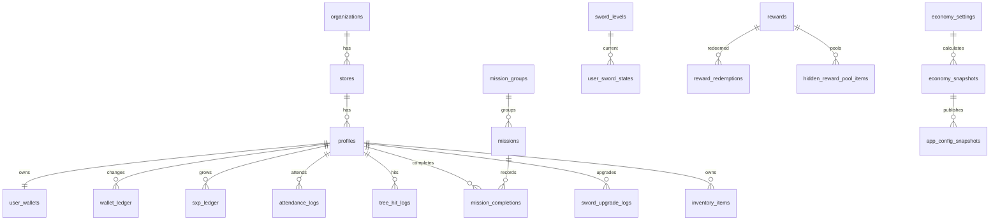

# DB_DESIGN_DRAFT.md

## 상태

- 작성일: 2026-05-28
- 상태: v2 SQL Supabase migration 실행 완료
- SQL 실행 여부: 2026-05-29 실행 완료
- 목적: U-Quest의 실제 운영 DB를 Supabase에 만들기 전, 빠진 흐름과 문서 충돌을 먼저 정리한다.

---

# 1. CTO 결론

현재 `supabase/schema.sql`은 방향은 맞다.  
다만 실제 서비스로 운영하려면 아래 4개가 반드시 보강되어야 한다.

1. 돈/보상/타격권 변경 내역을 남기는 원장
2. 미션 승인, 출석, 나무 타격, 검 강화, 보상 교환 로그
3. 관리자 권한 범위
4. 관리자 설정값을 사용자 화면에 반영하는 스냅샷 구조

쉽게 말하면 지금 스키마는 "가계부의 현재 잔액"은 있는데, "언제 왜 돈이 들어오고 나갔는지"가 부족하다.  
U-Quest는 리워드 서비스이기 때문에 잔액보다 내역이 더 중요하다.

---

# 2. 기존 문서와 충돌 정리

## 2.1 `uquest_master_documentation_v_1.md`

합본 원본은 방향성이 명확하다.

- 회사 활동 → 타격권 → 나무 타격 → 코인/SXP → 성장/상점
- 현금성 보상은 제한
- 성장 체감은 크게
- 경제식은 서버에서 계산
- 관리자 설정값이 사용자 화면을 지배

이 초안은 위 흐름과 충돌하지 않는다.

## 2.2 `DATABASE_SCHEMA.md`

초기 문서에는 `users` 안에 `coin`, `hidden_coin`, `sxp`, `sword_level`이 같이 들어가 있다.  
운영 DB에서는 이 구조를 그대로 쓰지 않는 것이 좋다.

권장 구조:

- `profiles`: 사람의 기본 정보
- `user_wallets`: 현재 잔액
- `wallet_ledger`: 잔액이 바뀐 모든 이유
- `sxp_ledger`: 성장 경험치가 바뀐 모든 이유
- `user_sword_states`: 현재 검 상태
- `sword_upgrade_logs`: 검 강화 이력

이렇게 나누면 나중에 "왜 코인이 줄었지?", "누가 보상을 지급했지?", "검 강화에 얼마가 들어갔지?"를 추적할 수 있다.

## 2.3 `ECONOMY_RULE.md`

경제 문서의 핵심 원칙은 유지한다.

```text
타격권은 참여감이다.
코인은 경제다.
SXP는 성장이다.
히든은 도파민이다.
경제보정계수는 안전장치다.
```

DB에서는 이 원칙을 다음처럼 반영한다.

- 타격권, 코인, 히든코인, 주문서는 `wallet_ledger`에 기록한다.
- SXP는 `sxp_ledger`에 기록한다.
- 경제 계산 결과는 `economy_snapshots`에 저장한다.
- 사용자가 보는 값은 `app_config_snapshots`로 내려준다.

## 2.4 `ADMIN_RULE.md`

관리자 기능은 DB상에서 아래 설정 테이블과 로그 테이블로 분리한다.

- 미션 관리: `mission_groups`, `missions`
- 보상 관리: `rewards`, `hidden_reward_pool_items`
- 경제 설정: `economy_settings`, `economy_snapshots`
- 성장 관리: `sword_levels`, `collectibles`
- 변경 이력: `admin_audit_logs`

---

# 3. 전체 구조



핵심은 3층 구조다.

| 층 | 역할 | 예시 |
|---|---|---|
| 원본 설정 | 관리자가 수정하는 기준값 | 미션, 보상, 검 레벨, 경제 설정 |
| 운영 기록 | 사용자가 실제로 한 일 | 출석, 미션 완료, 나무 타격, 보상 교환 |
| 화면 스냅샷 | 사용자 화면이 빠르게 읽는 결과 | `app_config_snapshots.payload` |

---

# 4. 테이블 초안

## 4.1 회사/사용자/권한

### `organizations`

회사 단위. 지금은 1개 회사만 쓰더라도 나중에 확장 가능하게 둔다.

| 컬럼 | 설명 |
|---|---|
| `id` | 회사 ID |
| `name` | 회사명 |
| `active` | 사용 여부 |
| `created_at` | 생성일 |

### `stores`

매장/지점 단위.

| 컬럼 | 설명 |
|---|---|
| `id` | 매장 ID |
| `organization_id` | 회사 ID |
| `name` | 매장명 |
| `code` | 내부 코드 |
| `active` | 사용 여부 |
| `sort_order` | 정렬 순서 |
| `created_at` | 생성일 |

### `teams`

매장 안의 팀, 교육조, 파트 구분이 필요할 때 사용한다.  
초기에는 비워두어도 된다.

| 컬럼 | 설명 |
|---|---|
| `id` | 팀 ID |
| `store_id` | 매장 ID |
| `name` | 팀명 |
| `active` | 사용 여부 |
| `sort_order` | 정렬 순서 |

### `profiles`

Supabase Auth 사용자와 연결되는 서비스 사용자 정보.

| 컬럼 | 설명 |
|---|---|
| `id` | `auth.users.id`와 같은 값 |
| `organization_id` | 회사 ID |
| `store_id` | 소속 매장 |
| `team_id` | 소속 팀 |
| `display_name` | 표시 이름 |
| `employee_no` | 사번 또는 내부 식별값 |
| `phone` | 연락처 |
| `onboarding_day` | 온보딩 진행 일차 |
| `person_level` | 사람 레벨 |
| `sxp_total` | 현재 SXP 합계 |
| `active` | 재직/사용 여부 |
| `approved_by` | 승인한 관리자 |
| `approved_at` | 승인 시간 |
| `created_at` | 가입일 |

### `role_assignments`

관리자/점장/팀장 권한 범위.  
한 사람이 여러 매장을 관리할 수 있으므로 `profiles.role` 하나로 끝내지 않는다.

| 컬럼 | 설명 |
|---|---|
| `id` | 권한 ID |
| `user_id` | 사용자 ID |
| `role` | `employee`, `store_manager`, `team_lead`, `super_admin` |
| `scope_type` | `organization`, `store`, `team`, `global` |
| `organization_id` | 권한 범위 회사 |
| `store_id` | 권한 범위 매장 |
| `team_id` | 권한 범위 팀 |
| `active` | 사용 여부 |
| `assigned_by` | 권한 부여자 |
| `created_at` | 생성일 |

---

## 4.2 미션/출석

### `mission_groups`

홈 화면의 미션 묶음.

| 컬럼 | 설명 |
|---|---|
| `id` | 그룹 ID |
| `title` | 그룹명 |
| `icon` | 임시 아이콘 또는 asset key |
| `asset_key` | 이미지 교체용 키 |
| `active` | 노출 여부 |
| `sort_order` | 정렬 순서 |

### `missions`

관리자가 수정하는 미션 원본.

| 컬럼 | 설명 |
|---|---|
| `id` | 미션 ID |
| `group_id` | 미션 그룹 |
| `title` | 미션명 |
| `mission_type` | `attendance`, `routine`, `quiz`, `axdx`, `event`, `manual` |
| `validation_method` | `auto`, `quiz`, `manager_approval`, `external`, `manual` |
| `source_label` | 화면에 보이는 출처 라벨 |
| `base_ticket` | 기본 타격권 |
| `base_sxp` | 기본 SXP |
| `base_scroll` | 기본 주문서 |
| `importance_factor` | 중요도 계수 |
| `daily_limit` | 1일 완료 제한 |
| `starts_at` | 시작일 |
| `ends_at` | 종료일 |
| `active` | 사용 여부 |
| `sort_order` | 정렬 순서 |
| `metadata` | 퀴즈/외부연동 등 추가 설정 |

### `mission_completions`

미션 수행/승인 이력.  
기존 `mission_logs`보다 상태를 더 명확히 둔다.

| 컬럼 | 설명 |
|---|---|
| `id` | 완료 ID |
| `user_id` | 사용자 |
| `mission_id` | 미션 |
| `status` | `pending`, `approved`, `rejected`, `auto_approved`, `cancelled` |
| `progress` | 완료율 |
| `period_date` | 일일 제한 판단 날짜 |
| `evidence_payload` | 증빙/퀴즈 답변/외부 결과 |
| `reward_ticket` | 확정 지급 타격권 |
| `reward_sxp` | 확정 지급 SXP |
| `reward_scroll` | 확정 지급 주문서 |
| `requested_at` | 요청 시간 |
| `approved_by` | 승인자 |
| `approved_at` | 승인 시간 |
| `rejected_reason` | 반려 사유 |
| `idempotency_key` | 중복 지급 방지 키 |

### `attendance_logs`

출석 전용 로그.  
`user_id + attendance_date`는 중복될 수 없다.

| 컬럼 | 설명 |
|---|---|
| `id` | 출석 ID |
| `user_id` | 사용자 |
| `attendance_date` | 출석일 |
| `streak_day` | 연속 출석 일수 |
| `reward_ticket` | 출석 보상 타격권 |
| `reward_sxp` | 출석 보상 SXP |
| `created_at` | 생성일 |

---

## 4.2.1 퀴즈 확장 테이블

처음에는 퀴즈를 `missions.metadata` 안에 넣어도 된다.  
다만 문제은행, 정답률, 오답 복습, 여러 문항 출제를 하려면 아래 테이블로 분리한다.

### `quiz_questions`

| 컬럼 | 설명 |
|---|---|
| `id` | 문제 ID |
| `mission_id` | 연결 미션 |
| `question_text` | 문제 |
| `question_type` | `single_choice`, `multiple_choice`, `short_answer` |
| `explanation` | 해설 |
| `active` | 사용 여부 |
| `sort_order` | 정렬 순서 |

### `quiz_options`

| 컬럼 | 설명 |
|---|---|
| `id` | 보기 ID |
| `question_id` | 문제 ID |
| `option_text` | 보기 내용 |
| `is_correct` | 정답 여부 |
| `sort_order` | 정렬 순서 |

### `quiz_attempts`

| 컬럼 | 설명 |
|---|---|
| `id` | 응시 ID |
| `user_id` | 사용자 |
| `mission_completion_id` | 미션 완료 기록 |
| `score_pct` | 점수 |
| `passed` | 통과 여부 |
| `answer_payload` | 제출 답안 |
| `created_at` | 응시 시간 |

---

## 4.3 지갑/성장 원장

### `user_wallets`

현재 잔액 캐시.  
직접 신뢰할 최종 근거는 아니고, 빠른 화면 표시용이다.

| 컬럼 | 설명 |
|---|---|
| `user_id` | 사용자 |
| `coin` | 일반 코인 잔액 |
| `hidden_coin` | 히든코인 잔액 |
| `scroll` | 주문서 잔액 |
| `remaining_ticket` | 남은 타격권 |
| `lifetime_ticket_earned` | 누적 획득 타격권 |
| `lifetime_hits` | 누적 타격 수 |
| `updated_at` | 갱신일 |

### `wallet_ledger`

타격권, 코인, 히든코인, 주문서의 모든 증감 기록.

| 컬럼 | 설명 |
|---|---|
| `id` | 원장 ID |
| `user_id` | 사용자 |
| `currency_type` | `ticket`, `coin`, `hidden_coin`, `scroll` |
| `amount` | 증감량. 차감은 음수 |
| `balance_after` | 변경 후 잔액 |
| `source_type` | `mission`, `attendance`, `tree_hit`, `sword_upgrade`, `reward_redeem`, `admin_adjust`, `event` |
| `source_id` | 원인이 된 기록 ID |
| `economy_snapshot_id` | 적용된 경제 스냅샷 |
| `idempotency_key` | 중복 지급 방지 키 |
| `created_at` | 생성일 |

### `sxp_ledger`

SXP 성장 경험치 원장.  
SXP는 현금성 보상과 성격이 달라 별도 원장으로 둔다.

| 컬럼 | 설명 |
|---|---|
| `id` | 원장 ID |
| `user_id` | 사용자 |
| `amount` | SXP 증감량 |
| `balance_after` | 변경 후 SXP |
| `source_type` | `mission`, `attendance`, `tree_hit`, `admin_adjust`, `event` |
| `source_id` | 원인이 된 기록 ID |
| `idempotency_key` | 중복 지급 방지 키 |
| `created_at` | 생성일 |

---

## 4.4 나무 타격

### `tree_hit_logs`

나무를 1번 칠 때마다 생기는 결과 로그.

| 컬럼 | 설명 |
|---|---|
| `id` | 타격 ID |
| `user_id` | 사용자 |
| `sword_level` | 타격 당시 검 레벨 |
| `ticket_spent` | 사용한 타격권 |
| `base_coin` | 기본 코인 |
| `final_coin` | 최종 지급 코인 |
| `sxp_awarded` | 지급 SXP |
| `scroll_awarded` | 지급 주문서 |
| `hidden_roll_pct` | 적용된 히든 확률 |
| `hidden_won` | 히든 당첨 여부 |
| `hidden_reward_id` | 당첨된 히든 보상 |
| `economy_snapshot_id` | 적용된 경제 스냅샷 |
| `result_payload` | 연출용 결과 JSON |
| `created_at` | 생성일 |

이 테이블이 있어야 나중에 경제 밸런싱을 할 수 있다.

---

## 4.5 검/성장/수집 요소

### `sword_levels`

관리자가 조정하는 검 레벨 원본.

| 컬럼 | 설명 |
|---|---|
| `level` | 검 레벨 |
| `label` | 화면 표시 라벨 |
| `name` | 검 이름 |
| `required_person_level` | 필요 사람 레벨 |
| `required_sxp` | 필요 SXP |
| `required_coin` | 강화 비용 코인 |
| `required_scroll` | 강화 비용 주문서 |
| `coin_multiplier` | 코인 획득 배율 |
| `coin_cap` | 1타 최대 코인 |
| `hidden_chance_bonus_pct` | 히든 확률 보너스 |
| `extra_coin_hit` | 추가 코인 효과 |
| `asset_key` | 검 이미지 키 |
| `active` | 사용 여부 |

### `user_sword_states`

사용자의 현재 검 상태.

| 컬럼 | 설명 |
|---|---|
| `user_id` | 사용자 |
| `sword_level` | 현재 검 레벨 |
| `upgraded_at` | 마지막 강화일 |

### `sword_upgrade_logs`

검 강화 시도/성공 로그.

| 컬럼 | 설명 |
|---|---|
| `id` | 강화 로그 ID |
| `user_id` | 사용자 |
| `from_level` | 이전 레벨 |
| `to_level` | 다음 레벨 |
| `required_coin` | 사용 코인 |
| `required_scroll` | 사용 주문서 |
| `result` | `success`, `failed`, `cancelled` |
| `created_at` | 생성일 |

### `collectibles`

칭호, 배지, 프로필 프레임, 아바타, 검 스킨 등 수집/해금 요소.

| 컬럼 | 설명 |
|---|---|
| `id` | 수집품 ID |
| `collectible_type` | `title`, `badge`, `frame`, `avatar`, `outfit`, `sword_skin` |
| `name` | 이름 |
| `description` | 설명 |
| `asset_key` | 이미지 키 |
| `unlock_condition` | 해금 조건 JSON |
| `active` | 사용 여부 |
| `sort_order` | 정렬 순서 |

### `user_collectibles`

사용자가 획득한 수집품.

| 컬럼 | 설명 |
|---|---|
| `id` | 보유 ID |
| `user_id` | 사용자 |
| `collectible_id` | 수집품 |
| `earned_from_type` | 획득 경로 |
| `earned_from_id` | 획득 원인 ID |
| `earned_at` | 획득일 |

### `profile_equipment`

사용자가 현재 착용/표시 중인 칭호, 배지, 프레임.

| 컬럼 | 설명 |
|---|---|
| `user_id` | 사용자 |
| `title_id` | 대표 칭호 |
| `badge_id` | 대표 배지 |
| `frame_id` | 프로필 프레임 |
| `avatar_id` | 아바타 |
| `outfit_id` | 의상 |
| `sword_skin_id` | 검 스킨 |
| `updated_at` | 갱신일 |

---

## 4.6 보상/상점/인벤토리

### `rewards`

일반 보상과 히든 보상의 원본 카탈로그.

| 컬럼 | 설명 |
|---|---|
| `id` | 보상 ID |
| `reward_kind` | `normal`, `hidden`, `event` |
| `title` | 보상명 |
| `description` | 설명 |
| `asset_key` | 이미지 키 |
| `currency_type` | `coin`, `hidden_coin`, `free` |
| `cost_amount` | 가격 |
| `stock_total` | 총 재고 |
| `stock_remaining` | 남은 재고 |
| `external_product_code` | 기프티콘 상품 코드 |
| `provider` | 외부 연동사 |
| `active` | 사용 여부 |
| `featured` | 강조 여부 |
| `sort_order` | 정렬 순서 |
| `starts_at` | 판매 시작일 |
| `ends_at` | 판매 종료일 |
| `metadata` | 추가 정보 |

### `hidden_reward_pool_items`

히든 박스 후보와 가중치.  
기존 `hidden_reward_candidates`보다 `rewards`와 연결하는 편이 중복이 적다.

| 컬럼 | 설명 |
|---|---|
| `id` | 히든 풀 ID |
| `reward_id` | 보상 ID |
| `rarity` | 희귀도 |
| `probability_weight` | 확률 가중치 |
| `min_sword_level` | 최소 검 레벨 |
| `stock_limit` | 풀 내 재고 제한 |
| `active` | 사용 여부 |
| `sort_order` | 정렬 순서 |

### `reward_redemptions`

상점 교환/히든 당첨/외부 발송 상태.

| 컬럼 | 설명 |
|---|---|
| `id` | 교환 ID |
| `user_id` | 사용자 |
| `reward_id` | 보상 |
| `redemption_type` | `shop`, `hidden_box`, `admin_grant`, `event` |
| `cost_currency_type` | 차감 재화 |
| `cost_amount` | 차감 금액 |
| `status` | `requested`, `paid`, `fulfilled`, `failed`, `cancelled`, `refunded` |
| `external_order_id` | 외부 발송 주문 ID |
| `delivery_payload` | 외부 발송 결과. 민감값은 서버 전용으로 취급 |
| `requested_at` | 요청일 |
| `fulfilled_at` | 지급 완료일 |
| `cancelled_at` | 취소일 |

### `inventory_items`

사용자가 가진 아이템/쿠폰함.

| 컬럼 | 설명 |
|---|---|
| `id` | 인벤토리 ID |
| `user_id` | 사용자 |
| `reward_id` | 보상 |
| `redemption_id` | 교환 기록 |
| `item_type` | `coupon`, `badge`, `ticket`, `hidden_reward`, `gifticon` |
| `title` | 표시명 |
| `asset_key` | 이미지 키 |
| `status` | `available`, `used`, `expired`, `cancelled` |
| `issued_at` | 발급일 |
| `used_at` | 사용일 |
| `expires_at` | 만료일 |

---

## 4.7 경제 설정/스냅샷

### `economy_settings`

관리자가 직접 입력하는 경제 기준값.  
`id = current` 싱글톤으로 시작한다.

| 컬럼 | 설명 |
|---|---|
| `id` | `current` |
| `per_user_monthly_base_budget_krw` | 1인 월 기본 보상 한도 |
| `per_user_monthly_max_budget_krw` | 1인 특별 포함 최대 한도 |
| `coin_value_krw` | 코인 1개 원가 |
| `daily_ticket_limit` | 1일 최대 타격권 |
| `event_multiplier` | 이벤트 배율 |
| `hidden_reward_avg_value_krw` | 히든 1회 평균 가치 |
| `auto_adjust_enabled` | 자동 보정 사용 여부 |
| `updated_by` | 수정 관리자 |
| `updated_at` | 수정일 |

### `economy_snapshots`

시스템이 계산한 경제 결과.  
나중에 왜 이런 지급량이 나왔는지 추적하기 위해 매번 저장한다.

| 컬럼 | 설명 |
|---|---|
| `id` | 스냅샷 ID |
| `active_employee_count` | 활성 직원 수 |
| `participation_rate_pct` | 참여율 |
| `avg_daily_ticket` | 평균 일일 타격권 |
| `estimated_monthly_hits` | 월 예상 타격 수 |
| `monthly_base_budget_krw` | 월 기본 예산 |
| `monthly_hidden_budget_krw` | 월 히든 예산 |
| `one_hit_average_coin` | 1타 평균 코인 |
| `economy_factor` | 경제보정계수 |
| `hidden_base_probability_pct` | 기본 히든 확률 |
| `estimated_monthly_payout_krw` | 예상 월 지급액 |
| `budget_risk` | `safe`, `watch`, `danger` |
| `input_payload` | 계산 입력 JSON |
| `output_payload` | 계산 결과 JSON |
| `created_by` | 계산 실행자 |
| `created_at` | 생성일 |

### `events`

기간 한정 이벤트, 보너스, 배율.

| 컬럼 | 설명 |
|---|---|
| `id` | 이벤트 ID |
| `title` | 이벤트명 |
| `event_multiplier` | 코인/보상 배율 |
| `bonus_ticket` | 추가 타격권 |
| `starts_at` | 시작 시간 |
| `ends_at` | 종료 시간 |
| `active` | 사용 여부 |
| `config_payload` | 추가 설정 JSON |

### `app_config_snapshots`

사용자 화면과 관리자 화면이 읽는 최종 JSON.  
프론트는 여러 테이블을 직접 조합하지 않고 이 값을 우선 읽는다.

| 컬럼 | 설명 |
|---|---|
| `id` | `current` |
| `payload` | 화면 렌더링용 JSON |
| `version` | 스냅샷 버전 |
| `economy_snapshot_id` | 기준 경제 스냅샷 |
| `generated_from` | `admin`, `system`, `seed` |
| `updated_at` | 갱신일 |

---

## 4.8 관리자/연동/이미지

### `admin_audit_logs`

관리자가 바꾼 모든 설정 변경 이력.

| 컬럼 | 설명 |
|---|---|
| `id` | 로그 ID |
| `admin_user_id` | 관리자 |
| `action` | 작업명 |
| `target_table` | 대상 테이블 |
| `target_id` | 대상 ID |
| `before_value` | 변경 전 |
| `after_value` | 변경 후 |
| `request_id` | 요청 추적 ID |
| `created_at` | 생성일 |

### `asset_registry`

이미지/아이콘/PNG/WebP 교체를 위한 자산 목록.

| 컬럼 | 설명 |
|---|---|
| `id` | 자산 ID |
| `asset_key` | 코드와 DB가 공유하는 키 |
| `bucket` | Supabase Storage bucket |
| `path` | 파일 경로 |
| `alt_text` | 대체 텍스트 |
| `active` | 사용 여부 |
| `created_at` | 생성일 |

### `external_webhook_events`

기프티콘 API, 알림톡, 외부 시스템 콜백 로그.

| 컬럼 | 설명 |
|---|---|
| `id` | 이벤트 ID |
| `provider` | 외부 서비스 |
| `event_type` | 이벤트 타입 |
| `external_id` | 외부 ID |
| `payload` | 원본 payload |
| `processed_at` | 처리 시간 |
| `created_at` | 수신 시간 |

---

## 4.9 랭킹/시즌/알림 확장

랭킹과 시즌은 PRD에는 있지만 MVP에서는 뒤로 미루는 것을 추천한다.  
다만 DB 이름을 미리 정해두면 나중에 구조가 흔들리지 않는다.

### `seasons`

| 컬럼 | 설명 |
|---|---|
| `id` | 시즌 ID |
| `title` | 시즌명 |
| `starts_at` | 시작일 |
| `ends_at` | 종료일 |
| `active` | 사용 여부 |
| `reward_policy` | 시즌 보상 정책 JSON |

### `leaderboard_snapshots`

랭킹은 실시간 집계보다 스냅샷 방식이 안전하다.  
직원 화면에는 계산 완료된 순위만 보여준다.

| 컬럼 | 설명 |
|---|---|
| `id` | 랭킹 스냅샷 ID |
| `season_id` | 시즌 |
| `scope_type` | `global`, `store`, `team` |
| `scope_id` | 범위 ID |
| `metric` | `sxp`, `mission_count`, `hit_count`, `attendance_streak` |
| `payload` | 랭킹 결과 JSON |
| `created_at` | 생성일 |

### `notification_jobs`

알림톡, 문자, 푸시 알림을 붙일 때 사용한다.

| 컬럼 | 설명 |
|---|---|
| `id` | 알림 작업 ID |
| `user_id` | 수신 사용자 |
| `channel` | `kakao`, `sms`, `email`, `push` |
| `template_key` | 템플릿 키 |
| `payload` | 발송 변수 |
| `status` | `pending`, `sent`, `failed`, `cancelled` |
| `scheduled_at` | 예약 시간 |
| `sent_at` | 발송 시간 |

---

# 5. 서버 함수/RPC 초안

프론트에서 직접 잔액을 바꾸면 안 된다.  
아래 작업은 서버 함수나 Edge Function으로 처리한다.

| 함수 | 역할 |
|---|---|
| `claim_attendance` | 출석 체크, 타격권/SXP 지급 |
| `complete_mission` | 미션 완료 요청/자동 승인/보상 지급 |
| `approve_mission_completion` | 관리자가 미션 승인 |
| `hit_tree` | 타격권 차감, 코인/SXP/히든 결과 지급 |
| `upgrade_sword` | 코인/주문서 차감, 검 레벨 갱신 |
| `redeem_reward` | 상점 교환, 재고 차감, 인벤토리 발급 |
| `publish_app_config_snapshot` | 관리자 설정 변경 후 화면 JSON 재생성 |
| `recalculate_economy_snapshot` | 경제 설정 기반 계산 결과 저장 |

원칙:

- 하나의 행동은 하나의 트랜잭션으로 끝낸다.
- 잔액 변경은 항상 원장에 먼저 남긴다.
- 같은 요청이 두 번 들어와도 `idempotency_key`로 중복 지급을 막는다.
- 프론트는 성공 결과만 화면에 반영한다.

---

# 6. RLS 보안 초안

Supabase 공식 문서 기준으로 `public` 스키마 테이블은 RLS를 켜야 한다.  
또한 `auth.uid()`는 로그인하지 않은 경우 `null`이므로, 정책에는 인증 여부를 명시한다.

참고: https://supabase.com/docs/guides/database/postgres/row-level-security

## 6.1 기본 원칙

- 모든 `public` 테이블에 RLS 활성화
- 사용자 개인 정보/지갑/로그는 본인만 조회
- 점장/팀장은 자기 범위의 직원만 조회
- `super_admin`은 전체 조회/수정 가능
- 설정 테이블 수정은 관리자만 가능
- 사용자 화면용 `app_config_snapshots`는 로그인 사용자에게 읽기 허용
- 서비스 키는 서버 함수에서만 사용하고 브라우저에 노출하지 않음

## 6.2 정책 예시

| 테이블 | 직원 | 점장/팀장 | 슈퍼관리자 |
|---|---|---|---|
| `profiles` | 본인 조회 | 소속 범위 조회 | 전체 조회/수정 |
| `user_wallets` | 본인 조회 | 소속 범위 조회 | 전체 조회 |
| `wallet_ledger` | 본인 조회 | 소속 범위 조회 | 전체 조회 |
| `mission_completions` | 본인 조회/요청 | 소속 범위 승인 | 전체 관리 |
| `rewards` | 활성 보상 조회 | 조회 | 생성/수정 |
| `economy_settings` | 조회 제한 | 조회 제한 | 수정 |
| `app_config_snapshots` | 조회 | 조회 | 재생성 |

## 6.3 필수 인덱스

RLS와 조회 성능을 위해 아래 인덱스가 필요하다.

- `profiles(store_id)`
- `profiles(team_id)`
- `role_assignments(user_id, role, active)`
- `role_assignments(store_id, team_id)`
- `mission_completions(user_id, period_date)`
- `mission_completions(mission_id, period_date)`
- `attendance_logs(user_id, attendance_date)`
- `wallet_ledger(user_id, created_at)`
- `tree_hit_logs(user_id, created_at)`
- `reward_redemptions(user_id, requested_at)`
- `inventory_items(user_id, status)`
- `rewards(active, sort_order)`
- `missions(active, sort_order)`

---

# 7. 관리자 설정값과 화면 연결

프론트 하드코딩 금지 항목은 아래 테이블에서 온다.

| 화면 값 | DB 원본 |
|---|---|
| 미션명 | `missions.title` |
| 미션 묶음 | `mission_groups` |
| 미션 보상 타격권 | `missions.base_ticket`, `importance_factor` |
| 출석 보상 | `economy_settings`, `events`, 서버 계산 |
| 검 레벨 | `sword_levels` |
| 검 강화 비용 | `sword_levels.required_coin`, `required_scroll` |
| 검 배율 | `sword_levels.coin_multiplier` |
| 히든 확률 | `economy_snapshots.hidden_base_probability_pct`, `sword_levels.hidden_chance_bonus_pct` |
| 보상명/가격 | `rewards` |
| 보상 정렬 | `rewards.sort_order` |
| 이미지 경로 | `asset_registry`, 각 테이블의 `asset_key` |
| 이벤트 배율 | `events`, `economy_settings.event_multiplier` |

사용자 화면은 최종적으로 `app_config_snapshots.payload`를 읽는다.  
관리자가 값을 바꾸면 서버가 관련 테이블을 저장하고, 경제 계산을 다시 한 뒤, 이 스냅샷을 갱신한다.

---

# 8. MVP에 바로 필요한 테이블

처음부터 모든 기능을 한 번에 구현하지 않더라도, 아래 테이블은 1차 DB에 넣는 것을 추천한다.

1. `organizations`
2. `stores`
3. `teams`
4. `profiles`
5. `role_assignments`
6. `user_wallets`
7. `wallet_ledger`
8. `sxp_ledger`
9. `mission_groups`
10. `missions`
11. `mission_completions`
12. `attendance_logs`
13. `tree_hit_logs`
14. `sword_levels`
15. `user_sword_states`
16. `sword_upgrade_logs`
17. `collectibles`
18. `user_collectibles`
19. `profile_equipment`
20. `rewards`
21. `hidden_reward_pool_items`
22. `reward_redemptions`
23. `inventory_items`
24. `economy_settings`
25. `economy_snapshots`
26. `events`
27. `app_config_snapshots`
28. `asset_registry`
29. `admin_audit_logs`

`quiz_questions`, `quiz_options`, `quiz_attempts`는 퀴즈를 문제은행으로 운영할 때 추가한다.  
`seasons`, `leaderboard_snapshots`, `notification_jobs`, `external_webhook_events`는 시즌/랭킹/알림/기프티콘 API 붙일 때 추가해도 된다.  
하지만 교환 기록인 `reward_redemptions`는 초기에 있어야 한다.

---

# 9. 아직 결정이 필요한 질문

아래는 SQL 실행 전 확인하면 좋은 항목이다.

1. 조직 구조가 `회사 → 매장 → 팀`이면 충분한가?
2. 점장/팀장은 직원 미션을 직접 승인하는가, 아니면 외부 시스템에서 자동 완료되는가?
3. 퀴즈는 단순 미션의 `metadata`로 충분한가, 아니면 문제/보기/정답 테이블이 따로 필요한가?
4. 기프티콘 API는 어떤 업체를 쓸 예정인가?
5. 쿠폰 코드를 DB에 직접 저장할지, 외부 업체 링크만 저장할지 결정해야 하는가?
6. `골드`와 `코인` 용어를 하나로 통일할 것인가?
7. 랭킹/시즌제를 MVP에 넣을 것인가, 2차로 뺄 것인가?

CTO 추천:

- MVP는 `회사 → 매장 → 팀` 구조로 충분하다.
- 퀴즈는 처음에는 `missions.metadata`로 처리하고, 문제은행이 필요해지면 별도 테이블로 분리한다.
- 랭킹/시즌제는 2차로 미룬다.
- `골드/코인`은 `coin` 하나로 통일한다.

---

# 10. 다음 작업 순서

1. 이 초안을 검토한다.
2. `DATABASE_SCHEMA.md`를 이 초안 기준으로 정상 한국어 문서로 재작성한다.
3. `supabase/schema.sql`을 v2 구조로 교체한다.
4. Supabase MCP로 migration을 실행한다.
5. 목업 데이터를 seed로 넣는다.
6. `app_config_snapshots.payload`를 실제 프론트 타입과 맞춘다.
7. `hit_tree`, `complete_mission`, `redeem_reward` 서버 함수를 만든다.

---

# 11. 한 줄 요약

현재는 화면용 DB 초안에서 운영용 DB 설계로 넘어가는 단계다.  
가장 중요한 결정은 "잔액만 저장하지 말고, 모든 변경 이유를 원장과 로그로 남긴다"이다.
